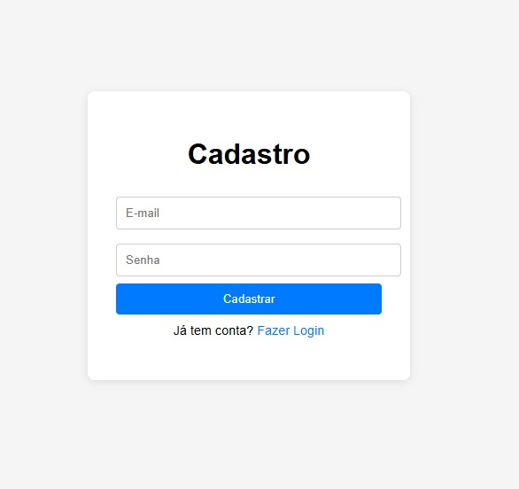
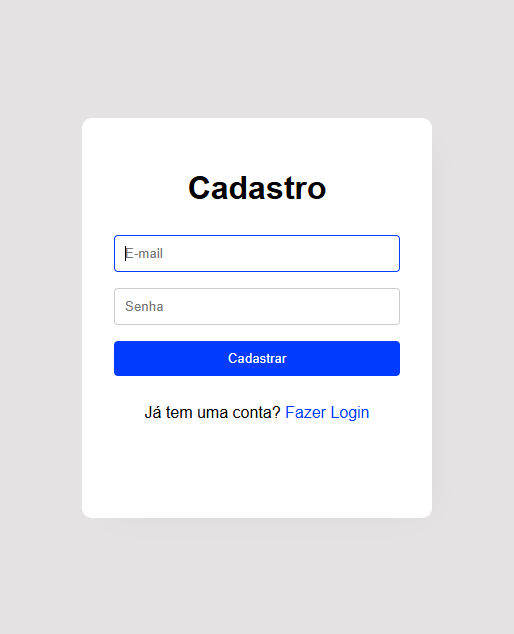

# Formulário de Login

Este projeto é um exemplo de página de formulário de login simples, feito com **HTML** e **CSS**.

## 📄 Sobre

- Desenvolvido na **mentoria da Tipscode**.
- Centralizado verticalmente na tela (`flexbox`).
- Utilização de **variáveis CSS** para facilitar personalizações.
- Botão com efeito `hover`.
- Inputs estilizados para melhor experiência de usuário (`focus`).

## 🚀 Tecnologias usadas

- HTML5
- CSS3

## 📸 Telas

### 🎯 Tela Proposta


### ✅ Tela Finalizada


## 📦 Como usar

1. Clone o repositório:
   ```bash
   git clone https://github.com/ssantiago121/tela-login.git
